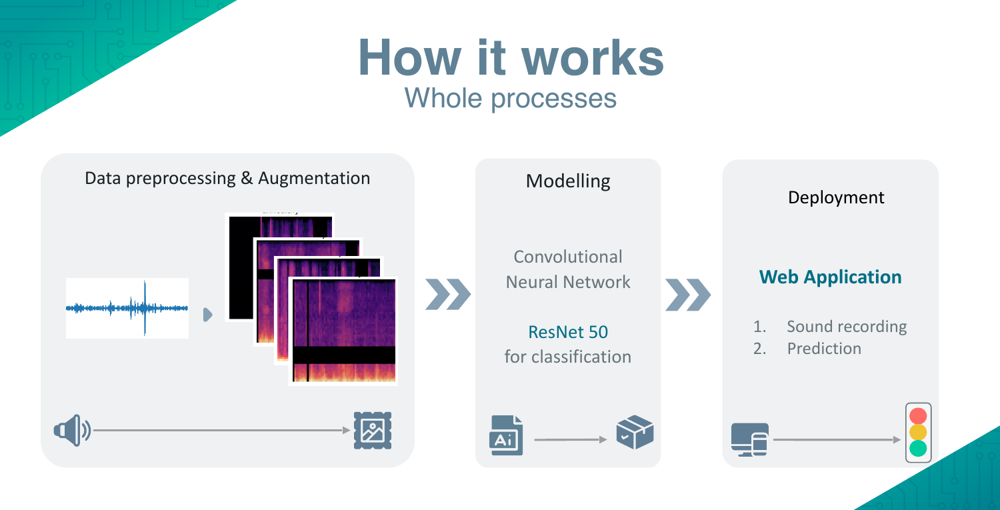
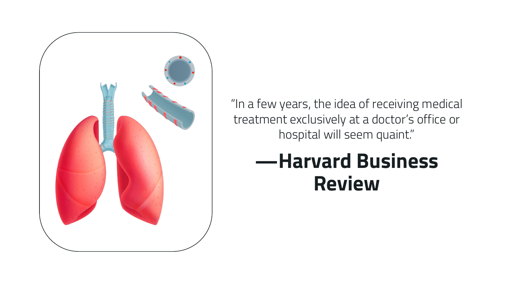
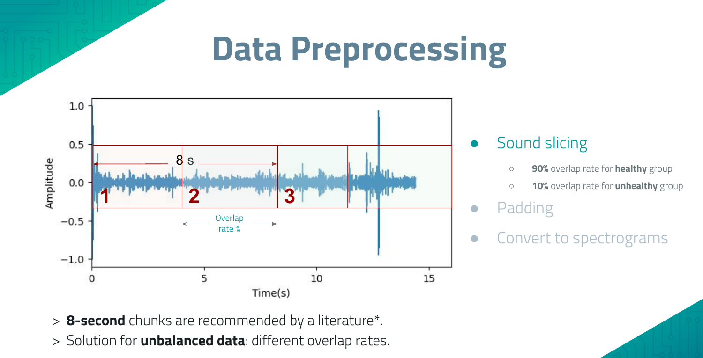
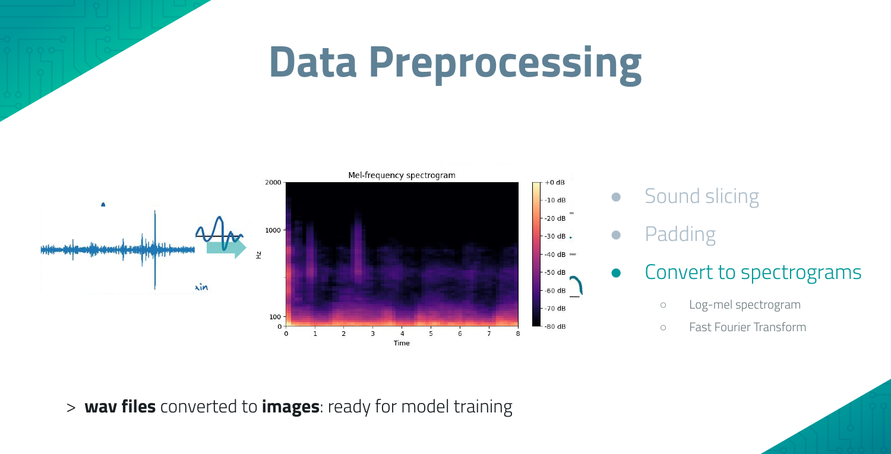
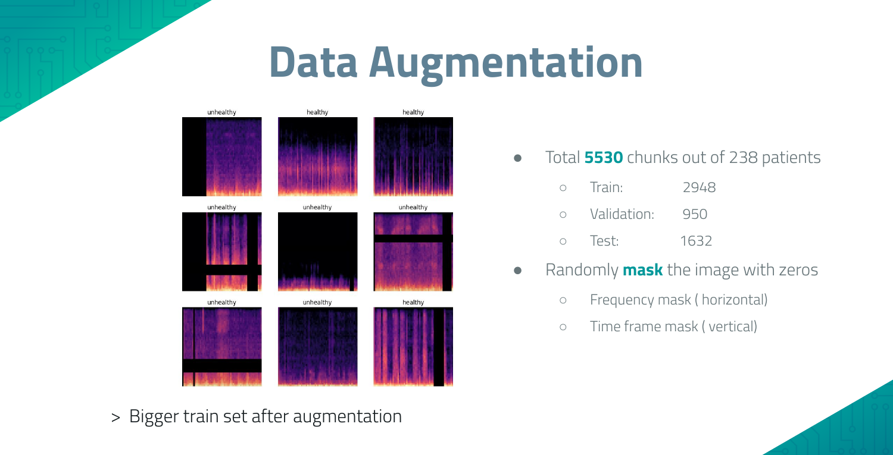
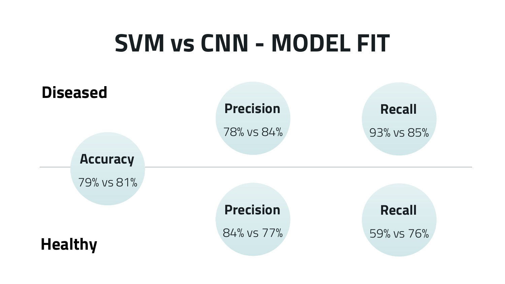
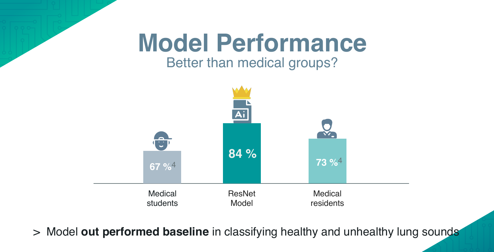
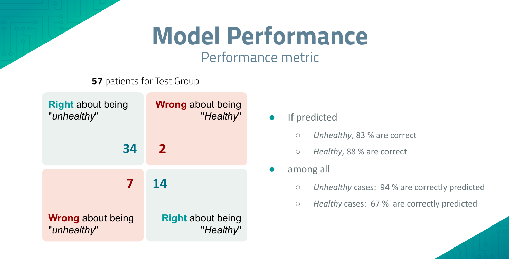
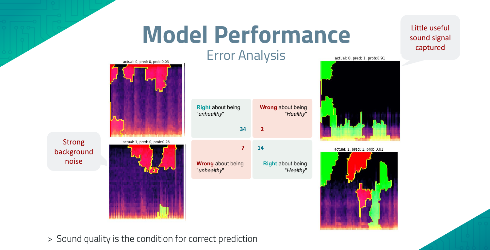

# Respiratory Sound Classification

**Detecting respiratory disease from lung sounds with deep learning** — a ResNet50V2 transfer-learning model that classifies breath audio recordings as healthy or suspicious, deployed as a browser-based recording app.


> ⚠️ **Disclaimer**: Model predictions are for reference only and must never replace medical advice from a doctor.

## Motivation

Chronic respiratory diseases affect roughly [7% of humanity](https://www.thelancet.com/journals/lanres/article/PIIS2213-2600(20)30157-0/fulltext), and COPD is the [third leading cause of death worldwide](https://www.who.int/news-room/fact-sheets/detail/the-top-10-causes-of-death). Auscultation (listening to lung sounds) is cheap and non-invasive, but requires a trained clinician. This project explores whether a neural network can perform a first-pass screening from a simple microphone or digital stethoscope recording — making telehealth triage accessible to anyone with a phone or laptop.

## How it works



Raw breath recordings are sliced into chunks, converted to log-mel spectrograms, and classified by a fine-tuned convolutional neural network. A web app records audio in the browser and returns the probability of healthy airways.

## Data

Two public datasets of annotated lung auscultation recordings were combined:

- [ICBHI Respiratory Sound Database](https://www.kaggle.com/datasets/vbookshelf/respiratory-sound-database) (126 participants)
- [Mendeley electronic-stethoscope dataset](https://data.mendeley.com/datasets/jwyy9np4gv/3) (112 participants)



That's **238 participants** (37% female, infancy to >90 years) providing ~7 hours of auscultation audio: 61 healthy and 177 diseased (124 chronic — predominantly COPD and asthma — and 53 acute). The labels are heavily **imbalanced** (~74% diseased), which shaped the preprocessing strategy below.

## Preprocessing & augmentation

Audio is sliced into **8-second chunks** and converted to log-mel spectrograms. The class imbalance is tackled at the slicing stage: healthy recordings are cut with **90% overlap** and diseased recordings with only **10% overlap**, oversampling the minority class to a nearly balanced training set.



Residual pieces are zero-pre-padded to keep every chunk the same length, then each chunk is transformed into a log-mel spectrogram image:



The resulting **5,530 spectrograms** (train 2,948 / validation 950 / test 1,632) are further augmented with random frequency masking (horizontal bars), time masking (vertical bars), and random volume reduction:



## Model

**Transfer learning with ResNet50V2** (TensorFlow/Keras), pre-trained on ImageNet:

1. Replace the 1000-class output with a densely connected layer and a single sigmoid output (healthy vs. suspicious).
2. Freeze the base model and train the new head.
3. Unfreeze and fine-tune the entire network with a 40× smaller initial learning rate.

A classical **SVM baseline** on the same features was built for comparison — the CNN wins on overall accuracy and, crucially, on recall for the healthy class:



## Results

On a held-out test group of **57 patients**, the model reaches **84% accuracy** — compared to 67% for medical students and 73% for medical residents [reported in the literature](https://www.nature.com/articles/s41598-021-96724-7) for the same task:





| Metric | Diseased | Healthy |
|---|---|---|
| Precision | 83% | 88% |
| Recall | 94% | 67% |

The threshold is deliberately tuned for **high recall on the diseased class** — for a screening tool, missing an ill patient is worse than a false alarm.

### Error analysis

Inspecting the misclassified spectrograms shows that prediction errors are dominated by **recording quality**: strong background noise or recordings with little usable breath signal:



## Web app

The model is served through a Streamlit app with a custom in-browser audio recorder component (Media API → WAV → prediction), shown in the demo GIF above. The app lives in its own repository: [loukra/RespiratoryApp](https://github.com/loukra/RespiratoryApp).

## Repository structure

```
├── ResNet50_Transfer_Learning.ipynb   # main training notebook
├── notebooks/
│   ├── Preprocessing/                 # slicing, padding, spectrograms, dataset balancing
│   └── Model/                         # SVM baseline, clustering, ensemble experiments
├── scripts/                           # reusable preprocessing & prediction modules
├── data/                              # dataset annotations & diagnosis metadata (no audio)
└── assets/                            # figures used in this README
```

Raw audio is not included — download the datasets from the links in the [Data](#data) section.

## Setup

```bash
git clone git@github.com:loukra/respiratory-sound-classification.git
cd respiratory-sound-classification
make setup          # pyenv 3.9.8 + venv + requirements
source .venv/bin/activate
```

### Trained model

The fine-tuned ResNet50V2 weights (270 MB) are published as a [release asset](https://github.com/loukra/respiratory-sound-classification/releases/tag/v1.0.0):

```bash
gh release download v1.0.0 --pattern ResNet.h5 --dir models
# or without the GitHub CLI:
curl -L --create-dirs -o models/ResNet.h5 \
  https://github.com/loukra/respiratory-sound-classification/releases/download/v1.0.0/ResNet.h5
```

```python
import tensorflow as tf
model = tf.keras.models.load_model("models/ResNet.h5")
```

## Future work

- Multi-class output: distinguish adventitious sounds (crackles, wheezes, rhonchi) and acute vs. chronic disease
- More training data (HF_Lung_V1, app-collected recordings)
- A mobile app running the model on-device

## About this project

Built as the capstone project of the [neuefische Data Science bootcamp](https://www.neuefische.de) (2022) together with [Rafael Cámara](https://github.com/medscoops) (epidemiologist & MD) and [Li Xie](https://github.com/puenktchenli) (PhD Biophysics). My focus was data preprocessing, augmentation, and model training.

This is my curated portfolio version of the [original group repository](https://github.com/loukra/Respiratory_Disease_Classification), which remains unchanged — the full commit history is preserved here, so individual contributions stay verifiable.

- **Louis Krause** — [GitHub](https://github.com/loukra) · [LinkedIn](https://www.linkedin.com/in/louis-krause)

## References

1. Nguyen & Pernkopf, ["Lung Sound Classification Using Co-Tuning and Stochastic Normalization"](https://doi.org/10.1109/TBME.2022.3156293), IEEE Trans. Biomed. Eng. 69(9), 2022
2. Fraiwan et al., ["A dataset of lung sounds recorded from the chest wall using an electronic stethoscope"](https://doi.org/10.1016/j.dib.2021.106913), Data Brief 35, 2021
3. Kim et al., ["Respiratory sound classification for crackles, wheezes, and rhonchi in the clinical field using deep learning"](https://doi.org/10.1038/s41598-021-96724-7), Sci Rep 11, 2021
4. He et al., ["Deep Residual Learning for Image Recognition"](https://arxiv.org/abs/1512.03385), CVPR 2016
